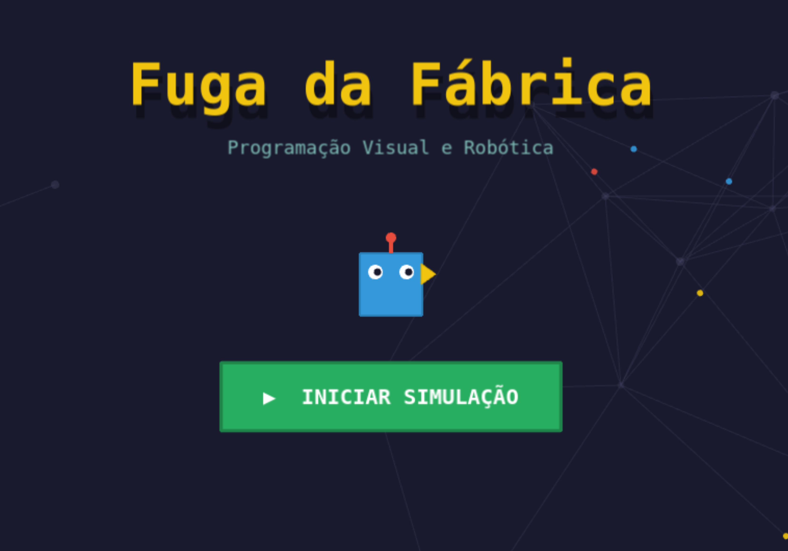

# 🤖 Fuga da Fábrica (Objeto de Aprendizagem)

**Fuga da Fábrica** é um Objeto de Aprendizagem (OA) interativo, desenvolvido em formato de jogo web, voltado para o ensino de Lógica de Programação e Pensamento Computacional para alunos do Ensino Fundamental (10 a 14 anos).

O projeto foi construído com alta granulosidade e foco em reusabilidade, permitindo que educadores utilizem níveis específicos para apoiar metodologias ativas de ensino.

## 🎯 Objetivo Pedagógico

O jogo propõe que o aluno atue como programador de um robô autônomo em um ambiente fabril. Através de uma interface visual de montagem de blocos (nós lógicos), o aluno desenvolve habilidades como:

- **Sequenciamento:** Relação de causa e efeito na execução de algoritmos.
- **Orientação Espacial:** Planejamento de rotas em eixos X e Y.
- **Lógica Condicional:** Tomada de decisão baseada na leitura de sensores e ramificação do fluxo de dados.

## ⚙️ Principais Funcionalidades

- **Interface Baseada em Nós:** Uma área de trabalho interativa inspirada em ferramentas de fluxo de dados (como o Node-RED), onde o usuário conecta "fios" entre portas de entrada e saída para rotear os comandos.
- **Feedback Visual em Tempo Real:** Os nós lógicos se iluminam sequencialmente conforme o interpretador percorre o grafo, permitindo o acompanhamento passo a passo da execução e facilitando o _debug_ pelo próprio aluno.
- **Cenários Dinâmicos:** Elementos com posições randomizadas (como o alvo no Nível 2) para evitar memorização de respostas e estimular a leitura do ambiente.
- **Múltiplos Estados (Sensores):** O Nível 3 introduz sensores que distinguem obstáculos de bloqueio e caminhos livres, ramificando o fluxo condicionalmente (If/Else).

